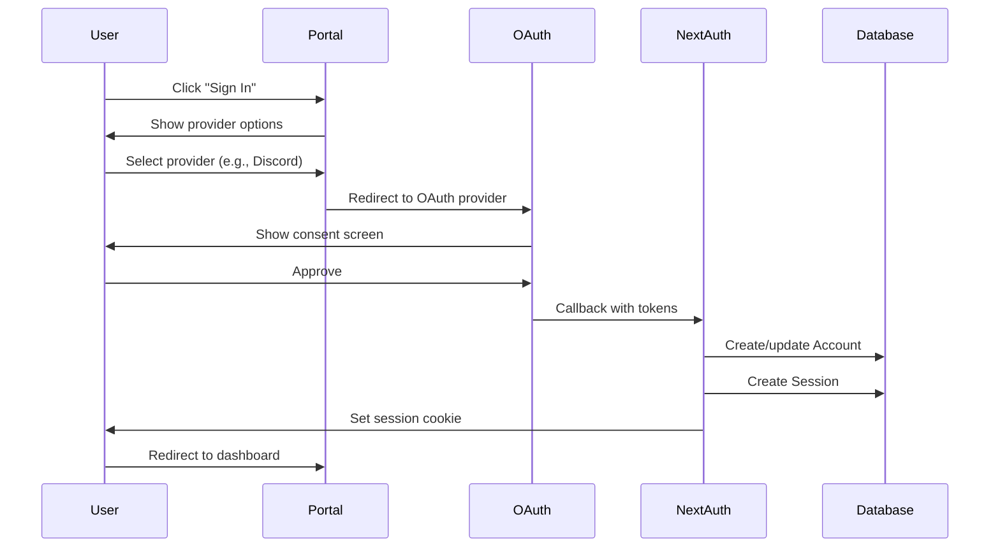

## Overview

The DeltaHacks Portal uses **[NextAuth.js v4](https://next-auth.js.org/)** for authentication, providing secure OAuth-based login with multiple providers. The system integrates with Prisma for session storage and implements role-based access control (RBAC).

## OAuth Providers

The portal supports five OAuth providers:

<CardGroup cols={2}>
  <Card title="Discord" icon="discord">
    Primary provider for DeltaHacks community members.
  </Card>
  
  <Card title="Google" icon="google">
    Common provider for students and professionals.
  </Card>
  
  <Card title="GitHub" icon="github">
    Popular among developers and hackers.
  </Card>
  
  <Card title="LinkedIn" icon="linkedin">
    Professional networking platform.
  </Card>
  
  <Card title="Azure AD" icon="microsoft">
    Enterprise authentication for organizations.
  </Card>
</CardGroup>

## NextAuth Configuration

The authentication is configured in `src/pages/api/auth/[...nextauth].ts`:

```typescript:src/pages/api/auth/[...nextauth].ts
import NextAuth, { type NextAuthOptions } from "next-auth";
import DiscordProvider from "next-auth/providers/discord";
import GoogleProvider from "next-auth/providers/google";
import GithubProvider from "next-auth/providers/github";
import LinkedInProvider from "next-auth/providers/linkedin";
import AzureADProvider from "next-auth/providers/azure-ad";
import { PrismaAdapter } from "@next-auth/prisma-adapter";
import { prisma } from "../../../server/db/client";
import { env } from "../../../env/server.mjs";

export const authOptions: NextAuthOptions = {
  callbacks: {
    session({ session, user }) {
      if (session.user) {
        session.user.id = user.id;
        session.user.role = user.role;
      }
      return session;
    },
  },
  pages: {
    signIn: "/login",
    signOut: "/login",
    error: "/login",
  },
  adapter: PrismaAdapter(prisma),
  providers: [
    DiscordProvider({
      clientId: env.DISCORD_CLIENT_ID,
      clientSecret: env.DISCORD_CLIENT_SECRET,
    }),
    GoogleProvider({
      clientId: env.GOOGLE_CLIENT_ID,
      clientSecret: env.GOOGLE_CLIENT_SECRET,
    }),
    GithubProvider({
      clientId: env.GITHUB_CLIENT_ID,
      clientSecret: env.GITHUB_CLIENT_SECRET,
    }),
    LinkedInProvider({
      clientId: env.LINKEDIN_CLIENT_ID,
      clientSecret: env.LINKEDIN_CLIENT_SECRET,
    }),
    AzureADProvider({
      clientId: env.AZURE_AD_CLIENT_ID,
      clientSecret: env.AZURE_AD_CLIENT_SECRET,
      tenantId: env.AZURE_AD_TENANT_ID,
    }),
  ],
};

export default NextAuth(authOptions);
```

## Environment Variables

Required environment variables in `.env`:

```bash
# NextAuth
NEXTAUTH_SECRET="your-secret-here"
NEXTAUTH_URL=http://localhost:3000
NEXT_PUBLIC_URL=http://localhost:3000

# Discord
DISCORD_CLIENT_ID="..."
DISCORD_CLIENT_SECRET="..."

# Google
GOOGLE_CLIENT_ID="..."
GOOGLE_CLIENT_SECRET="..."

# GitHub
GITHUB_CLIENT_ID="..."
GITHUB_CLIENT_SECRET="..."

# LinkedIn
LINKEDIN_CLIENT_ID="..."
LINKEDIN_CLIENT_SECRET="..."

# Azure AD
AZURE_AD_CLIENT_ID="..."
AZURE_AD_TENANT_ID="..."
AZURE_AD_CLIENT_SECRET="..."
```

<Note>
  Contact the Technical VPs to receive the required environment variables for development.
</Note>

## Authentication Flow



## Session Management

### Database Sessions

NextAuth uses the Prisma adapter to store sessions in the database:

```prisma
model Session {
  id           String   @id @default(cuid())
  sessionToken String   @unique
  userId       String
  expires      DateTime
  user         User     @relation(fields: [userId], references: [id], onDelete: Cascade)
}
```

### Session Callback

The session callback enriches the session with user ID and roles:

```typescript
callbacks: {
  session({ session, user }) {
    if (session.user) {
      session.user.id = user.id;
      session.user.role = user.role;  // Array of roles from database
    }
    return session;
  },
}
```

### TypeScript Types

Extend NextAuth types in `src/types/next-auth.d.ts`:

```typescript
import { Role } from "@prisma/client";
import { DefaultSession } from "next-auth";

declare module "next-auth" {
  interface Session {
    user?: {
      id: string;
      role: Role[];
    } & DefaultSession["user"];
  }
}
```

## Server-Side Session Access

### In API Routes

```typescript:src/pages/api/example.ts
import { getServerSession } from "next-auth";
import { authOptions } from "./auth/[...nextauth]";

export default async function handler(req, res) {
  const session = await getServerSession(req, res, authOptions);
  
  if (!session) {
    return res.status(401).json({ error: "Unauthorized" });
  }
  
  // Access user data
  const userId = session.user.id;
  const roles = session.user.role;
  
  res.json({ user: session.user });
}
```

### In getServerSideProps

```typescript
import { getServerAuthSession } from "../server/common/get-server-auth-session";

export async function getServerSideProps(context) {
  const session = await getServerAuthSession(context);
  
  if (!session) {
    return {
      redirect: {
        destination: "/login",
        permanent: false,
      },
    };
  }
  
  return {
    props: { session },
  };
}
```

### Helper Function

```typescript:src/server/common/get-server-auth-session.ts
import type { GetServerSidePropsContext } from "next";
import { getServerSession } from "next-auth";
import { authOptions } from "../../pages/api/auth/[...nextauth]";

export const getServerAuthSession = async (ctx: {
  req: GetServerSidePropsContext["req"];
  res: GetServerSidePropsContext["res"];
}) => {
  return await getServerSession(ctx.req, ctx.res, authOptions);
};
```

## Client-Side Session Access

### useSession Hook

```tsx
import { useSession } from "next-auth/react";

function ProfilePage() {
  const { data: session, status } = useSession();
  
  if (status === "loading") {
    return <div>Loading...</div>;
  }
  
  if (status === "unauthenticated") {
    return <div>Please sign in</div>;
  }
  
  return (
    <div>
      <p>Signed in as {session.user.email}</p>
      <p>Roles: {session.user.role.join(", ")}</p>
    </div>
  );
}
```

### Sign In/Out

```tsx
import { signIn, signOut } from "next-auth/react";

function LoginButton() {
  return (
    <button onClick={() => signIn("discord")}>Sign in with Discord</button>
  );
}

function LogoutButton() {
  return (
    <button onClick={() => signOut()}>Sign out</button>
  );
}
```

### Protected Client Components

```tsx
import { useSession } from "next-auth/react";
import { useRouter } from "next/router";
import { useEffect } from "react";

function ProtectedPage() {
  const { data: session, status } = useSession();
  const router = useRouter();
  
  useEffect(() => {
    if (status === "unauthenticated") {
      router.push("/login");
    }
  }, [status, router]);
  
  if (status === "loading") {
    return <div>Loading...</div>;
  }
  
  return <div>Protected content</div>;
}
```

## Role-Based Access Control

### Role Enum

Roles are defined in the Prisma schema:

```prisma
enum Role {
  HACKER          // Regular participants
  ADMIN           // Full administrative access
  REVIEWER        // Application review access
  FOOD_MANAGER    // Meal tracking and management
  EVENT_MANAGER   // Event check-in management
  GENERAL_SCANNER // General QR scanning access
  SPONSER         // Sponsor portal access
  JUDGE           // Project judging access
}
```

### User Roles

Users can have **multiple roles** (array):

```prisma
model User {
  role Role[] @default([HACKER])
}
```

### Server-Side Role Checks

#### In tRPC Procedures

```typescript
import { TRPCError } from "@trpc/server";
import { Role } from "@prisma/client";

export const adminRouter = router({
  deleteUser: protectedProcedure
    .input(z.object({ id: z.string() }))
    .mutation(async ({ ctx, input }) => {
      // Check if user has ADMIN role
      if (!ctx.session.user.role.includes(Role.ADMIN)) {
        throw new TRPCError({ code: "UNAUTHORIZED" });
      }
      
      // Admin-only operation
      await ctx.prisma.user.delete({ where: { id: input.id } });
    }),
});
```

#### Multiple Role Check

```typescript
export const applicationRouter = router({
  getAll: protectedProcedure.query(async ({ ctx }) => {
    const userRoles = ctx.session.user.role;
    
    // Allow ADMIN or REVIEWER
    if (!userRoles.includes(Role.ADMIN) && !userRoles.includes(Role.REVIEWER)) {
      throw new TRPCError({ code: "UNAUTHORIZED" });
    }
    
    return await ctx.prisma.dH12Application.findMany();
  }),
});
```

#### Role-Based Middleware

```typescript
import { middleware } from "./trpc";

const isAdmin = middleware(({ ctx, next }) => {
  if (!ctx.session?.user?.role.includes(Role.ADMIN)) {
    throw new TRPCError({ code: "FORBIDDEN" });
  }
  return next();
});

const adminProcedure = protectedProcedure.use(isAdmin);

export const adminRouter = router({
  deleteUser: adminProcedure
    .input(z.object({ id: z.string() }))
    .mutation(async ({ ctx, input }) => {
      // User is guaranteed to be admin
    }),
});
```

### Client-Side Role Checks

```tsx
import { useSession } from "next-auth/react";
import { Role } from "@prisma/client";

function AdminPanel() {
  const { data: session } = useSession();
  
  if (!session?.user?.role.includes(Role.ADMIN)) {
    return <div>Access denied</div>;
  }
  
  return <div>Admin content</div>;
}
```

### Conditional Rendering

```tsx
function Navigation() {
  const { data: session } = useSession();
  const roles = session?.user?.role || [];
  
  return (
    <nav>
      <a href="/dashboard">Dashboard</a>
      
      {roles.includes(Role.ADMIN) && (
        <a href="/admin">Admin Panel</a>
      )}
      
      {roles.includes(Role.REVIEWER) && (
        <a href="/reviews">Review Applications</a>
      )}
      
      {roles.includes(Role.JUDGE) && (
        <a href="/judging">Judge Projects</a>
      )}
      
      {(roles.includes(Role.FOOD_MANAGER) || roles.includes(Role.GENERAL_SCANNER)) && (
        <a href="/scanner">QR Scanner</a>
      )}
    </nav>
  );
}
```

## Protected Routes

### Page-Level Protection

```typescript:src/pages/admin.tsx
import { getServerAuthSession } from "../server/common/get-server-auth-session";
import { Role } from "@prisma/client";

export async function getServerSideProps(context) {
  const session = await getServerAuthSession(context);
  
  // Redirect if not authenticated
  if (!session) {
    return {
      redirect: {
        destination: "/login",
        permanent: false,
      },
    };
  }
  
  // Redirect if not admin
  if (!session.user.role.includes(Role.ADMIN)) {
    return {
      redirect: {
        destination: "/dashboard",
        permanent: false,
      },
    };
  }
  
  return {
    props: { session },
  };
}

function AdminPage({ session }) {
  return <div>Admin Dashboard</div>;
}

export default AdminPage;
```

### Middleware (Experimental)

Create `middleware.ts` at the root for route protection:

```typescript:middleware.ts
import { NextResponse } from "next/server";
import type { NextRequest } from "next/server";
import { getToken } from "next-auth/jwt";

export async function middleware(request: NextRequest) {
  const token = await getToken({ req: request });
  
  // Protect /admin routes
  if (request.nextUrl.pathname.startsWith("/admin")) {
    if (!token?.role?.includes("ADMIN")) {
      return NextResponse.redirect(new URL("/login", request.url));
    }
  }
  
  return NextResponse.next();
}

export const config = {
  matcher: ["/admin/:path*", "/scanner/:path*"],
};
```

## Managing User Roles

### Assigning Roles

```typescript
// Admin procedure to assign roles
export const adminRouter = router({
  assignRole: adminProcedure
    .input(z.object({
      userId: z.string(),
      role: z.nativeEnum(Role),
    }))
    .mutation(async ({ ctx, input }) => {
      const user = await ctx.prisma.user.findUnique({
        where: { id: input.userId },
      });
      
      if (!user) {
        throw new TRPCError({ code: "NOT_FOUND" });
      }
      
      // Add role if not already present
      if (!user.role.includes(input.role)) {
        await ctx.prisma.user.update({
          where: { id: input.userId },
          data: {
            role: {
              push: input.role,
            },
          },
        });
      }
    }),
});
```

### Removing Roles

```typescript
removeRole: adminProcedure
  .input(z.object({
    userId: z.string(),
    role: z.nativeEnum(Role),
  }))
  .mutation(async ({ ctx, input }) => {
    const user = await ctx.prisma.user.findUnique({
      where: { id: input.userId },
    });
    
    if (!user) {
      throw new TRPCError({ code: "NOT_FOUND" });
    }
    
    // Remove role
    await ctx.prisma.user.update({
      where: { id: input.userId },
      data: {
        role: user.role.filter(r => r !== input.role),
      },
    });
  }),
```

## Security Best Practices

<CardGroup cols={2}>
  <Card title="Use HTTPS in Production" icon="lock">
    Always use HTTPS for OAuth callbacks and session cookies.
  </Card>
  
  <Card title="Keep Secrets Secret" icon="key">
    Never commit `.env` files. Use secure secret management.
  </Card>
  
  <Card title="Validate Sessions Server-Side" icon="server">
    Always verify sessions on the server, not just the client.
  </Card>
  
  <Card title="Implement CSRF Protection" icon="shield">
    NextAuth automatically handles CSRF tokens.
  </Card>
  
  <Card title="Check Roles for Every Protected Operation" icon="user-shield">
    Never trust client-side role checks alone.
  </Card>
  
  <Card title="Use Short Session Expiry" icon="clock">
    Configure appropriate session timeout periods.
  </Card>
</CardGroup>

## Troubleshooting

### "NEXTAUTH_URL not set" Error

Ensure `NEXTAUTH_URL` is set in `.env`:
```bash
NEXTAUTH_URL=http://localhost:3000
```

### OAuth Callback Issues

Verify callback URLs in OAuth provider settings:
```
http://localhost:3000/api/auth/callback/discord
http://localhost:3000/api/auth/callback/google
```

### Session Not Persisting

Check:
1. Database connection is active
2. Session table exists in database
3. Cookies are enabled in browser
4. `NEXTAUTH_SECRET` is set

### Role Not Updated

Invalidate and refetch session after role changes:
```typescript
import { useSession } from "next-auth/react";

const { data: session, update } = useSession();

// Force session refresh
await update();
```

## See Also

- [Architecture Overview](/development/architecture) - System architecture
- [tRPC API](/development/trpc-api) - Protected procedures
- [Database Schema](/development/database-schema) - User and session models
- [NextAuth.js Documentation](https://next-auth.js.org/) - Official documentation