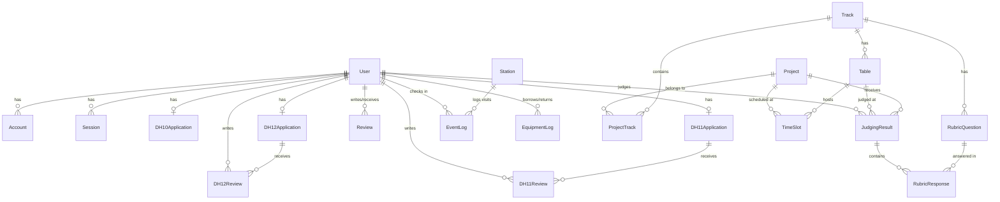

## Overview

The DeltaHacks Portal uses **Prisma** as the ORM with **CockroachDB** as the database. The schema is defined in `prisma/schema.prisma` and includes models for authentication, applications, reviews, judging, events, and equipment tracking.

## Database Provider

```prisma
datasource db {
  provider = "cockroachdb"
  url      = env("DATABASE_URL")
}
```

**CockroachDB** is a distributed SQL database that provides:
- PostgreSQL compatibility
- Horizontal scalability
- Built-in replication
- Serverless deployment options

## Core Authentication Models

These models are required by NextAuth.js for session management.

### User

The central user model that links to all other user-related data.

```prisma
model User {
  id                   String          @id @default(cuid())
  name                 String?
  email                String?         @unique
  emailVerified        DateTime?
  image                String?
  
  // NextAuth relations
  accounts             Account[]
  sessions             Session[]
  
  // Role-based access control
  role                 Role[]          @default([HACKER])
  
  // Application relations (one per year)
  dh10application      DH10Application? @relation(fields: [dH10ApplicationId], references: [id])
  dH10ApplicationId    String?          @unique
  DH11Application      DH11Application? @relation(fields: [DH11ApplicationId], references: [id])
  DH11ApplicationId    String?          @unique
  DH12Application      DH12Application? @relation(fields: [DH12ApplicationId], references: [id])
  DH12ApplicationId    String?          @unique
  
  // Review relations
  hacker               Review[]        @relation("hacker")
  reviewer             Review[]        @relation("reviewer")
  DH11Review           DH11Review[]
  DH12Review           DH12Review[]
  
  // Judging relations
  judge                JudgingResult[] @relation("judge")
  
  // Event tracking
  qrcode               Int?            @unique
  mealsTaken           Int             @default(0)
  lastMealTaken        DateTime?
  EventLog             EventLog[]
  
  // Equipment tracking
  EquipmentLogs        EquipmentLog[]
  EquipmentLogsAsAdmin EquipmentLog[]  @relation("EquipmentAdmin")
}
```

**Key Fields:**
- `id` - CUID (Collision-resistant Unique Identifier)
- `role` - Array of roles for RBAC (defaults to `[HACKER]`)
- `qrcode` - Unique integer for QR code generation
- `typeform_response_id` - Legacy field for Typeform integration

### Account

Stores OAuth provider account information.

```prisma
model Account {
  id                       String  @id @default(cuid())
  userId                   String
  type                     String
  provider                 String
  providerAccountId        String
  refresh_token            String?
  refresh_token_expires_in Int?
  access_token             String?
  expires_at               Int?
  token_type               String?
  scope                    String?
  id_token                 String?
  session_state            String?
  
  user                     User    @relation(fields: [userId], references: [id], onDelete: Cascade)
  
  @@unique([provider, providerAccountId])
}
```

**Providers Supported:**
- Discord
- Google
- GitHub
- LinkedIn
- Azure AD

### Session

Manages user sessions.

```prisma
model Session {
  id           String   @id @default(cuid())
  sessionToken String   @unique
  userId       String
  expires      DateTime
  
  user         User     @relation(fields: [userId], references: [id], onDelete: Cascade)
}
```

### VerificationToken

For email verification (NextAuth).

```prisma
model VerificationToken {
  identifier String
  token      String   @unique
  expires    DateTime
  
  @@unique([identifier, token])
}
```

## Application Models

The portal maintains separate application models for each year of DeltaHacks.

<Accordion title="DH10Application (2022)">
```prisma
model DH10Application {
  id String @id @default(cuid())
  
  // Personal information
  firstName String
  lastName  String
  birthday  DateTime
  
  // Education
  studyEnrolledPostSecondary Boolean
  studyLocation              String?
  studyDegree                String?
  studyMajor                 String?
  studyYearOfStudy           String?
  studyExpectedGraduation    DateTime?
  
  // Experience
  previousHackathonsCount Int
  
  // Long answers
  longAnswerChange     String  // "What change do you want to see?"
  longAnswerExperience String  // Experience question
  longAnswerTech       String  // Technology question
  longAnswerMagic      String  // "If you had magic..."
  
  // Additional info
  socialText String?
  interests  String?
  linkToResume String?
  
  // Preferences
  tshirtSize      String
  hackerKind      String
  alreadyHaveTeam Boolean
  workshopChoices String[]
  discoverdFrom   String[]
  considerCoffee  Boolean
  gender          String
  race            String
  macEv           Boolean  @default(false)
  
  // Emergency contact
  emergencyContactName     String
  emergencyContactPhone    String
  emergencyContactRelation String
  
  // MLH agreements
  agreeToMLHCodeOfConduct  Boolean
  agreeToMLHPrivacyPolicy  Boolean
  agreeToMLHCommunications Boolean
  
  User User?
}
```
</Accordion>

<Accordion title="DH11Application (2024)">
```prisma
model DH11Application {
  id String @id @default(cuid())
  
  // Personal information
  firstName String
  lastName  String
  phone     String?
  country   String?
  birthday  DateTime
  
  // Education
  studyEnrolledPostSecondary Boolean
  studyLocation              String?
  studyDegree                String?
  studyMajor                 String?
  studyYearOfStudy           String?
  studyExpectedGraduation    DateTime?
  
  // Experience
  previousHackathonsCount Int
  
  // Long answers (DH11-specific questions)
  longAnswerIncident  String  // Critical incident question
  longAnswerGoals     String  // Goals question
  longAnswerFood      String  // Food question
  longAnswerTravel    String  // Travel question
  longAnswerSocratica String  // Socratica partnership question
  
  // Additional info
  socialText String[] @default([])
  interests  String?
  linkToResume String?
  
  // Preferences
  tshirtSize          String
  hackerKind          String[] @default([])
  alreadyHaveTeam     Boolean
  workshopChoices     String[] @default([])
  discoverdFrom       String[] @default([])
  considerCoffee      Boolean
  dietaryRestrictions String?
  
  // Demographics
  underrepresented YesNoUnsure?
  gender           String
  race             String
  orientation      String
  
  // Emergency contact
  emergencyContactName     String
  emergencyContactPhone    String
  emergencyContactRelation String
  
  // MLH agreements
  agreeToMLHCodeOfConduct  Boolean
  agreeToMLHPrivacyPolicy  Boolean
  agreeToMLHCommunications Boolean
  
  // Status tracking
  rsvpCheck Boolean @default(false)
  status    Status  @default(IN_REVIEW)
  
  User       User?
  DH11Review DH11Review[]
}
```
</Accordion>

<Accordion title="DH12Application (2025)">
```prisma
model DH12Application {
  id String @id @default(cuid())
  
  // Personal information
  firstName String
  lastName  String
  phone     String?
  country   String?
  birthday  DateTime
  
  // Education
  studyEnrolledPostSecondary Boolean
  studyLocation              String?
  studyDegree                String?
  studyMajor                 String?
  studyYearOfStudy           String?
  studyExpectedGraduation    DateTime?
  
  // Experience
  previousHackathonsCount Int
  
  // Long answers (DH12-specific questions)
  longAnswerHobby     String  // Hobby question
  longAnswerWhy       String  // Why attend question
  longAnswerTime      String  // Time management question
  longAnswerSkill     String  // Skill question
  longAnswerSocratica String  // Socratica partnership question
  
  // Additional info
  socialText String[] @default([])
  interests  String?
  linkToResume String?
  
  // Preferences
  tshirtSize          String
  hackerKind          String[] @default([])
  alreadyHaveTeam     Boolean
  workshopChoices     String[] @default([])
  discoverdFrom       String[] @default([])
  considerCoffee      Boolean
  dietaryRestrictions String?
  
  // Demographics (optional in DH12)
  underrepresented YesNoUnsure?
  gender           String?
  race             String?
  orientation      String?
  
  // Emergency contact
  emergencyContactName     String
  emergencyContactPhone    String
  emergencyContactRelation String
  
  // MLH agreements
  agreeToMLHCodeOfConduct  Boolean
  agreeToMLHPrivacyPolicy  Boolean
  agreeToMLHCommunications Boolean
  
  // Status tracking
  rsvpCheck Boolean @default(false)
  status    Status  @default(IN_REVIEW)
  
  User       User?
  DH12Review DH12Review[]
}
```
</Accordion>

## Review Models

<Accordion title="Review (Legacy)">
```prisma
model Review {
  id         String @id @default(cuid())
  hackerId   String
  reviewerId String
  mark       Float  @default(0)
  
  hacker   User @relation("hacker", fields: [hackerId], references: [id], onDelete: Cascade)
  reviewer User @relation("reviewer", fields: [reviewerId], references: [id], onDelete: Cascade)
}
```
</Accordion>

<Accordion title="DH11Review">
```prisma
model DH11Review {
  id String @id @default(cuid())
  
  score   Float
  comment String
  
  reviewerId    String
  applicationId String
  
  application DH11Application @relation(fields: [applicationId], references: [id], onDelete: NoAction)
  reviewer    User            @relation(fields: [reviewerId], references: [id])
}
```
</Accordion>

<Accordion title="DH12Review">
```prisma
model DH12Review {
  id String @id @default(cuid())
  
  score   Float
  comment String
  
  reviewerId    String
  applicationId String
  
  application DH12Application @relation(fields: [applicationId], references: [id], onDelete: NoAction)
  reviewer    User            @relation(fields: [reviewerId], references: [id])
}
```
</Accordion>

## Judging System Models

<Accordion title="Project">
```prisma
model Project {
  id             String          @id @default(cuid())
  name           String
  description    String
  link           String
  tracks         ProjectTrack[]
  judgingResults JudgingResult[]
  TimeSlot       TimeSlot[]
  dhYear         String
}
```

Represents a hackathon project submission.
</Accordion>

<Accordion title="Track">
```prisma
model Track {
  id             String           @id @default(cuid())
  name           String
  dhYear         String
  ProjectTrack   ProjectTrack[]
  Table          Table[]
  RubricQuestion RubricQuestion[]
  
  @@unique([name, dhYear])
}
```

Tracks are categories/themes for projects (e.g., "Healthcare", "Education", "Sustainability").
</Accordion>

<Accordion title="ProjectTrack (Join Table)">
```prisma
model ProjectTrack {
  id        String  @id @default(cuid())
  project   Project @relation(fields: [projectId], references: [id], onDelete: Cascade)
  projectId String
  track     Track   @relation(fields: [trackId], references: [id], onDelete: Cascade)
  trackId   String
  
  @@unique([projectId, trackId])
}
```

Many-to-many relationship between projects and tracks.
</Accordion>

<Accordion title="Table">
```prisma
model Table {
  id            String          @id @default(cuid())
  number        Int
  trackId       String
  track         Track           @relation(fields: [trackId], references: [id])
  dhYear        String
  TimeSlot      TimeSlot[]
  JudgingResult JudgingResult[]
  
  @@unique([number, dhYear])
}
```

Physical tables where projects are judged.
</Accordion>

<Accordion title="TimeSlot">
```prisma
model TimeSlot {
  id        String   @id @default(cuid())
  startTime DateTime
  endTime   DateTime
  project   Project  @relation(fields: [projectId], references: [id], onDelete: Cascade)
  projectId String
  table     Table    @relation(fields: [tableId], references: [id], onDelete: Cascade)
  tableId   String
  dhYear    String
  
  @@unique([projectId, startTime])
  @@unique([tableId, startTime])
}
```

Schedules projects at specific tables during judging.
</Accordion>

<Accordion title="JudgingResult">
```prisma
model JudgingResult {
  id String @id @default(cuid())
  
  judgeId String
  judge   User   @relation("judge", fields: [judgeId], references: [id], onDelete: Cascade)
  
  project   Project          @relation(fields: [projectId], references: [id], onDelete: Cascade)
  projectId String
  
  responses RubricResponse[]
  
  dhYear String
  
  table   Table  @relation(fields: [tableId], references: [id], onDelete: Cascade)
  tableId String
  
  @@unique([judgeId, projectId])
}
```

Stores a judge's evaluation of a project.
</Accordion>

<Accordion title="RubricQuestion">
```prisma
model RubricQuestion {
  id        String           @id @default(cuid())
  title     String
  question  String
  points    Int
  trackId   String
  track     Track            @relation(fields: [trackId], references: [id], onDelete: Cascade)
  responses RubricResponse[]
}
```

Questions in the judging rubric, associated with a track.
</Accordion>

<Accordion title="RubricResponse">
```prisma
model RubricResponse {
  id              String         @id @default(cuid())
  score           Int
  judgingResultId String
  questionId      String
  judgingResult   JudgingResult  @relation(fields: [judgingResultId], references: [id], onDelete: Cascade)
  question        RubricQuestion @relation(fields: [questionId], references: [id], onDelete: Cascade)
  
  @@unique([judgingResultId, questionId])
}
```

A judge's answer to a specific rubric question.
</Accordion>

## Event Management Models

<Accordion title="EventLog">
```prisma
model EventLog {
  id        String   @id @default(cuid())
  userId    String
  user      User     @relation(fields: [userId], references: [id], onDelete: Cascade)
  timestamp DateTime @default(now())
  stationId String
  station   Station  @relation(fields: [stationId], references: [id])
  
  @@unique([userId, stationId])
}
```

Tracks when users check in to events or stations.
</Accordion>

<Accordion title="Station">
```prisma
model Station {
  id        String     @id @default(cuid())
  name      String
  option    String
  eventLogs EventLog[]
  
  @@unique([name, option])
}
```

Represents check-in locations or activities.
</Accordion>

<Accordion title="EquipmentLog">
```prisma
model EquipmentLog {
  id        String          @id @default(cuid())
  userId    String
  user      User            @relation(fields: [userId], references: [id], onDelete: Cascade)
  timestamp DateTime        @default(now())
  type      EquipmentType
  action    EquipmentAction
  adminId   String
  admin     User            @relation("EquipmentAdmin", fields: [adminId], references: [id])
  items     Json?
  notes     String?
}
```

Tracks hardware and sleeping bag checkouts/returns.
</Accordion>

## Configuration

```prisma
model Config {
  id String @id @default(cuid())
  
  name  String @unique
  value String
}
```

Stores dynamic configuration values.

## Enums

### Role

```prisma
enum Role {
  HACKER
  ADMIN
  REVIEWER
  FOOD_MANAGER
  EVENT_MANAGER
  GENERAL_SCANNER
  SPONSER
  JUDGE
}
```

### Status

```prisma
enum Status {
  IN_REVIEW
  REJECTED
  WAITLISTED
  ACCEPTED
  RSVP
  CHECKED_IN
}
```

Application status progression:
1. `IN_REVIEW` - Default state
2. `REJECTED` / `WAITLISTED` / `ACCEPTED` - Review decision
3. `RSVP` - Accepted and confirmed attendance
4. `CHECKED_IN` - Arrived at event

### YesNoUnsure

```prisma
enum YesNoUnsure {
  YES
  NO
  UNSURE
}
```

For demographic questions (underrepresented status).

### EquipmentType

```prisma
enum EquipmentType {
  SLEEPING_BAG
  HARDWARE
}
```

### EquipmentAction

```prisma
enum EquipmentAction {
  CHECK_OUT
  RETURN
}
```

## Entity Relationship Overview



## Database Operations

### Generate Prisma Client

```bash
pnpm db:generate
```

Generates TypeScript types from the schema.

### Push Schema to Database

```bash
pnpm db:push
```

Syncs the schema with the database (development).

### Create Migration

```bash
pnpm prisma migrate dev --name your_migration_name
```

### Deploy Migrations

```bash
pnpm db:migrate
```

### Open Prisma Studio

```bash
pnpm db:studio
```

Launches a GUI to browse and edit database data.

## See Also

- [Architecture Overview](/development/architecture) - System architecture
- [tRPC API](/development/trpc-api) - API layer using Prisma
- [Contributing](/development/contributing) - Database change guidelines